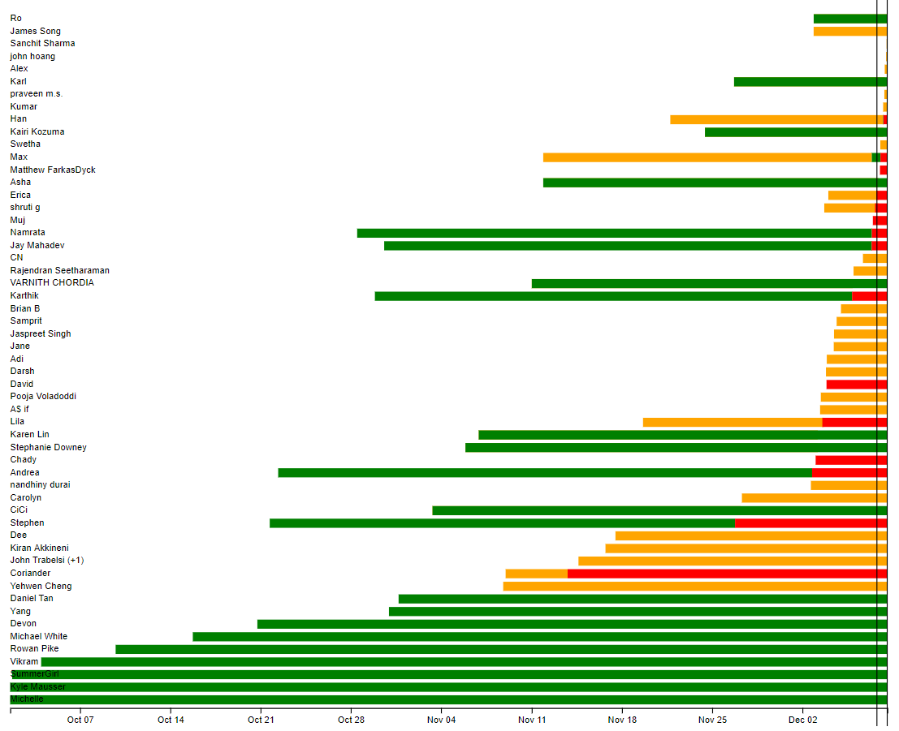

# Meetup RSVP email parser client

This project isn't done yet. It takes a JSON string from my [meetup-rsvp-email-parse](https://github.com/pfroud/meetup-rsvp-email-parse) project and makes an interactive graph. Here's what it does so far:

<table><tr><td>

</td></tr></table>

Each row is one user. Green means a "yes" RSVP, orange means they're on the waitlist, and red means a "no" RSVP. There are two vertical black lines on the far right. The right most line is the start of the event, and the other line is 48 hours before the start of the event.

Favicon by Five Icons, "Meetup icon", CC BY 2.5, https://www.iconfinder.com/icons/313118/meetup_icon, 